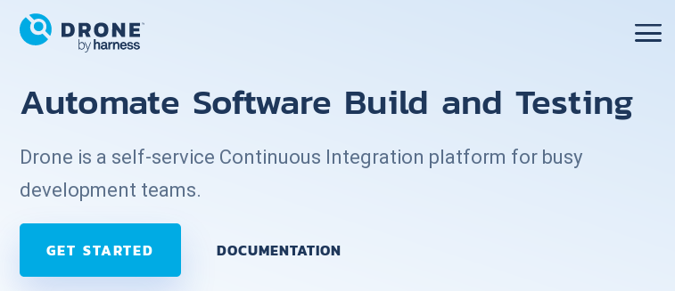

## Continuous Integration (CI) with Drone

[](https://drone.io)

[Drone](https://docs.drone.io/) is a Continuous Integration platform for automating build, test and release workflows.

### Installing the Drone CLI Tools

To interact with Drone from the command line, you need to install the Drone command
line tools.
Binaries for your environment and installation instructions can be found in
the [Drone CLI documentation](https://docs.drone.io/cli/install/).

For Linux, just enter

```bash
$ curl -L https://github.com/drone/drone-cli/releases/latest/download/drone_linux_amd64.tar.gz | tar zx
$ sudo install -t /usr/local/bin drone
```

Check your installation with

```bash
$ drone -v
```

The result should be something like

```text
drone version 1.2.4
```

### Connecting Drone CLI to GitHub

_Prerequisite: You need an account with sufficient rights on `ci.joomla.org`._

Open https://ci.joomla.org in your browser. Navigate to the user settings by clicking on your avatar in the upper right
corner and selecting "User settings". There you will find your personal token and examples for use with the API and the CLI.
In a terminal session, type

```bash
$ export DRONE_SERVER=https://ci.joomla.org
$ export DRONE_TOKEN=<your_personal_token>
$ drone info
```

If everything worked, you will see your username and email address:

```shell
User: <your_username>
Email: <your_email_address>
```

### Modify the `.drone.yml` File

_Prerequisite: You must have the Drone CLI tools installed and connected to GitHub._

For simplicity, the drone configuration is written to a [Jsonnet file](https://docs.drone.io/pipeline/scripting/jsonnet/),
`.drone.jsonnet`. To convert it to the corresponding `.drone.yml` file, go to the root directory of the repository and
then enter

```bash
$ drone jsonnet --stream
$ drone sign <owner>/<repo> --save
```

The `.drone.jsonnet` will be converted to the `.drone.yml` file and a signature will be added.
