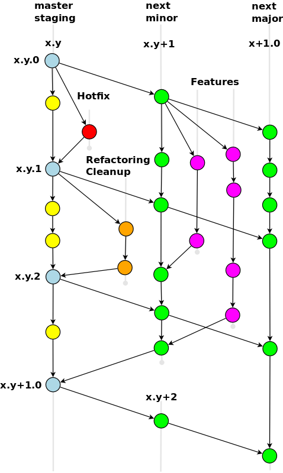

# Git Branch Model



## Main Branches

### Main Branch: `master` (or `staging`)

At its core, the development model is heavily inspired by existing models out there (mainly [Nvie Git Flow](https://nvie.com/posts/a-successful-git-branching-model/)).
The central repositories each contain a main branch with an infinite lifetime; for the CMS this is called `staging`, for the other projects it is `master`.

Unlike other Git flows published in the wild, Joomla does not support a separate branch for stable releases. 
This is not a disadvantage, as all releases get their own tag, which makes it easy to find the appropriate code state.
The main branch thus serves as both `master` and `develop` branch in terms of the Nvie model and contains the changes for the next release in addition to the latest stable release.

So we consider `master` (or `staging`) as the main branch where the source code of HEAD always reflects a state with the latest development changes applied for the next version.
This branch can therefore be called the 'integration branch'.
All automatic nightly builds are produced from here.

When the source code in the main branch reaches a stable point and is ready to be published, a release is
performed, automatically setting a version tag.
See [@todo: Release Cycle] for details on the release procedure.

### Release Branches: `x.y-dev`

Features usually take a long time to develop.
Following SemVer, adding a feature also requires increasing the minor version number (the *y* in *x.y.z*).
To still be able to make patch-level changes to the current version in the main branch, Joomla uses separate branches for one or more upcoming minor versions and the next major version (to be able to introduce B/C breaks).
These branches are called `x.y-dev`, where *x* and *y* are the major and minor version numbers, respectively.

Each `x.y-dev` branch is treated as the main branch for the corresponding release.
Once the source code in  the `x.y-dev` branch is stable and ready to be released, it is merged into the `master` (or `staging`) branch and deleted.
The main branch will only undergo minor fixes and some polishing before the release is finalized.

## Supporting Branches

Partial developments such as new features, bug fixes or refactoring are typically kept in separate branches in the developer repositories without corresponding branches in the central repository. They are moved to the central repository with pull requests.

### Feature Branches

Feature branches (or sometimes called topic branches) are used to develop new features for the next or a later release.
When development of a feature begins, it may well be that the target version into which that feature will be incorporated is unknown at that time.
A feature branch exists as long as the feature is in development until it is eventually merged with the appropriate release branch or discarded (in the case of a disappointing experiment).

#### Creating a feature branch

To start working on a new feature, create a new branch from the release branch that will receive the new feature.

```bash
$ git checkout -b my-feature x.y-dev
Switched to a new branch "my-feature"
```

#### Incorporating a finished feature on `master` / `x.y-dev`

Finished features may be merged into the develop branch to definitely add them to the upcoming release:

```bash
$ git checkout x.y-dev
Switched to branch 'x.y-dev'
$ git merge --no-ff my-feature
Updating ea1b82a..05e9557
(Summary of changes)
$ git branch -d my-feature
Deleted branch my-feature (was 05e9557).
$ git push origin x.y-dev
```

The `--no-ff` flag causes the merge to always create a new commit object, even if the merge could be performed with a fast-forward.
This avoids losing information about the historical existence of a feature branch and groups together all commits that together added the feature.

If a function has been merged into a release or main branch, it must be merged up into existing follow-on versions.

```bash
$ git checkout x.y+1-dev
Switched to branch 'x.y+1-dev'
$ git merge --no-ff x.y-dev
Updating ea1b82a..05e9557
(Summary of changes)
$ git checkout x+1.0-dev
Switched to branch 'x+1.0-dev'
$ git merge --no-ff x.y-dev
Updating ea1b82a..05e9557
(Summary of changes)
```
@todo check if merge command is right in this context
